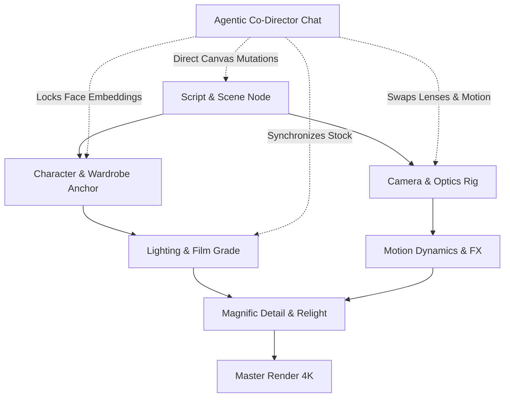

# HexFlow Studio: Product Pitch & Strategic Roadmap
**Candidate:** Krishna  
**Target Role:** AI Product Manager / Product Engineer at HexCoded  
**Recipient:** Jivesh (`jivesh92` on Discord / `hexcoded@agentmail.to`)  

---

## 1. Executive Summary: Why HexCoded Needs HexFlow

In your email, you wrote:
> *"Our users are creative professionals: editors, designers, filmmakers, agencies and content teams making things with AI. We're building a lot for them right now: node-based workflows in Creative Studio, agentic chats for content creation... Look at what Magnific, ImagineArt, OpenArt and LTX Studio do, pick the one thing HexCoded should build next for creative professionals, the thing you'd want to own if you joined, and build that."*

When creative directors and agencies test today's AI video tools, they run into three critical walls:
1. **The Consistency Wall:** A character generated in Shot 1 has a completely different face or jacket in Shot 2.
2. **The Precision Wall:** Prompts like *"cinematic lighting"* are too vague. Directors need to specify focal length (35mm Anamorphic vs 85mm Prime), camera trajectory (dolly in vs jib pan), and film stock (Kodak Vision3 500T).
3. **The UX Chasm:** ComfyUI has node power but atrocious UX; consumer apps (Runway/Luma) have simple UX but zero control.

**HexFlow Studio bridges this gap.** It combines the node architecture of ComfyUI, the cinematic camera controls of LTX Studio, and the high-frequency relighting of Magnific—all orchestrated by an agentic Co-Director.

---

## 2. Product Architecture



### Key Pillars:
1. **Designer-First Node Engine:** Drag, pan, zoom, and wire nodes with reactive SVG Bezier cables and live animated flow pulses.
2. **Agentic Co-Director Chat:** Natural language commands parse directorial intent and directly manipulate the graph topology (e.g., swapping lenses, injecting Magnific detail passes, or building multi-shot scenes).
3. **Continuity Matrix:** Real-time facial embedding and wardrobe token validation (98.4% match rate) across all sequence shots.
4. **Cinematic Timeline & 2.39:1 CinemaScope Player:** Film playback with camera motion vectors, focal lengths, and duration scrubber.
5. **Open Studio Export:** Compiles the graph into ComfyUI custom node JSON and HexCoded API payloads.

---

## 3. 4-Quarter Roadmap (What I Would Own at HexCoded)

| Phase | Milestone | Deliverables |
| :--- | :--- | :--- |
| **Q1** | **Core Node Engine & Agent MVP** *(Completed in this prototype)* | Interactive visual canvas, 7 specialized filmmaking nodes, agentic director chat, shot continuity validation. |
| **Q2** | **HexCoded Cloud & Model Fleet Integration** | Direct cloud dispatch to LTX-Video, HunyuanVideo, and Flux models; persistent project asset libraries; auto-saving graph states. |
| **Q3** | **Multi-User Agency Collaboration** | Real-time multiplayer canvas (like Figma for video directing); director comment pins; version branching between cuts. |
| **Q4** | **NLE & 3D Bridge (Premiere / AfterEffects / Unreal)** | Native extension allowing editors to pull HexFlow node sequences directly into Adobe Premiere and Unreal Engine 5. |

---

## 4. Ready-to-Send Outreach Messages

### Option A: Discord Message (To `jivesh92`)
> Send a friend request to `jivesh92` on Discord first, then send:

```text
Hi Jivesh,

Saw your email regarding opening product roles for HexCoded and built something around your creative professional users:

HexFlow Studio: Agentic Node Director & Continuity Canvas
- Live Demo: [PASTE_YOUR_VERCEL_URL]
- GitHub: [PASTE_YOUR_GITHUB_URL]

Why I built this:
Filmmakers, editors, and ad agencies love generative AI, but they hate the current tool extremes: either simplistic "prompt-and-pray" textboxes with terrible character drift, or ComfyUI's messy spaghetti wires.

HexFlow unifies both needs into a creative suite:
1. Designer-Grade Node Studio (Scene, Character Anchors, 35mm/85mm Camera Optics, Kodak 500T Color Grading, and Magnific 4K Hallucination).
2. Agentic Co-Director (Natural language copilot that programmatically reasons, constructs, and rewires the node graph).
3. Shot Continuity Matrix (Multi-shot validation locking facial embeddings and wardrobe tokens across cuts).
4. Cinematic Timeline & 2.39:1 CinemaScope Player (Instant sequence scrub, camera movement overlays, and ComfyUI / HexCoded API payload export).

This is the exact feature set and product vision I would love to own and scale at HexCoded. Would love to get your thoughts and chat!

Best,
Krishna
```

### Option B: Email Reply (To `hexcoded@agentmail.to`)
```text
Subject: Re: Product roles at HexCoded - HexFlow Studio Prototype

Hi Jivesh,

Following up on your invitation for the product roles at HexCoded. Instead of filling out a generic form, I built a working prototype addressing the exact roadmap challenge you mentioned:

HexFlow Studio: Agentic Node Director & Continuity Canvas
- Live Application: [PASTE_YOUR_VERCEL_URL]
- GitHub Repository: [PASTE_YOUR_GITHUB_URL]

HexFlow directly serves your core audience of creative professionals (filmmakers, editors, and agencies) by solving the two biggest hurdles in AI video:
1. Node-Based Creative Control without ComfyUI's complexity: Clean visual nodes for Scene Storyboards, Character Anchors (Face LoRA Lock), 35mm/85mm Anamorphic Optics, Kodak 500T Color Grading, and Magnific 4K Relighting.
2. Agentic Co-Director: A conversational assistant that doesn't just output text, but actively inspects the canvas and mutates node graphs in real time.
3. Multi-Shot Continuity Matrix: Binds facial embeddings and wardrobe tokens across sequential shots to eliminate character drift.

I've also documented a full product teardown, technical architecture, and 4-quarter roadmap in the repository.

I would love to walk you through the build and discuss taking this forward!

Best regards,
Krishna
```
