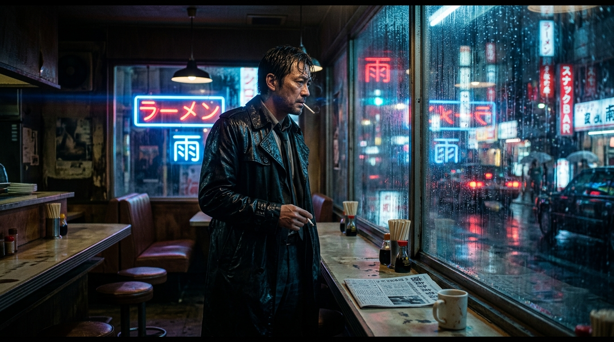
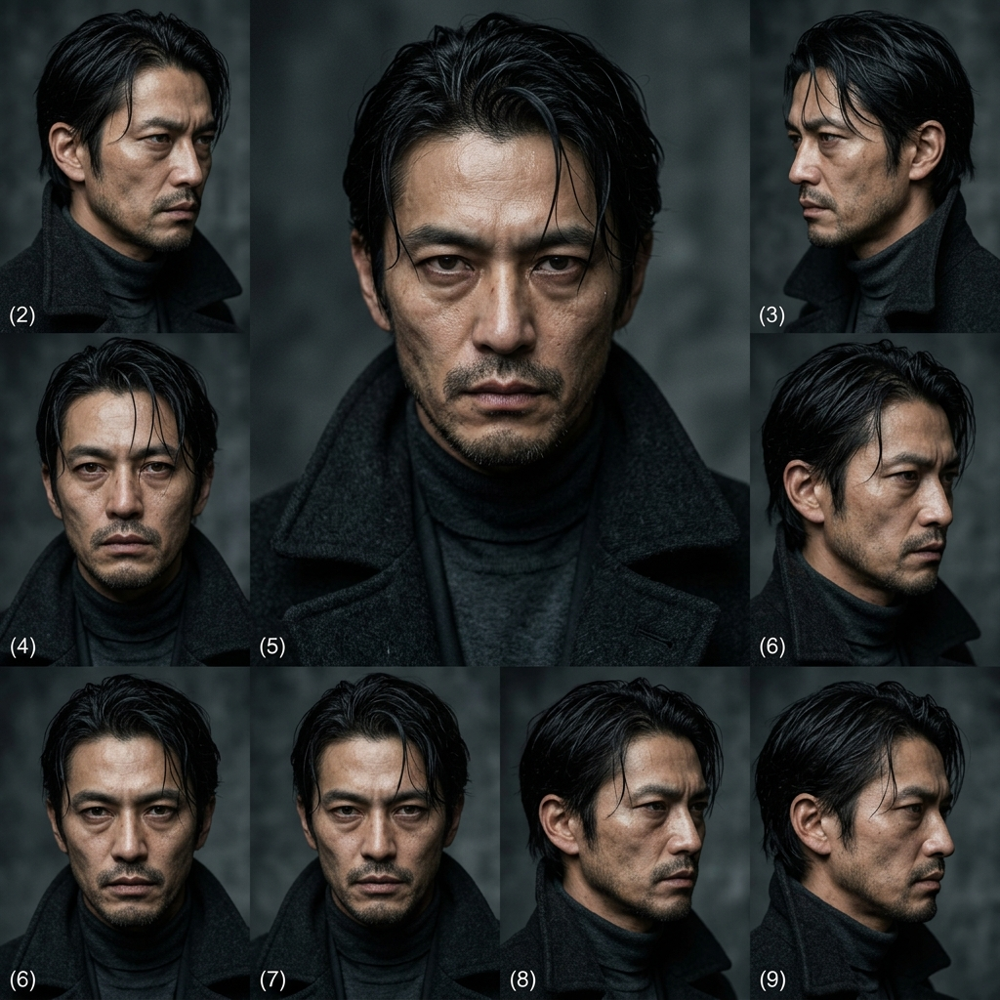
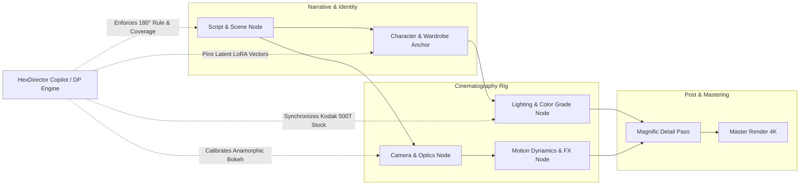

<div align="center">

# 🎬 HexFlow Studio
### Agentic Node Director & Multi-Shot Continuity Canvas for AI Filmmaking

[](https://hexcoded.ai)
[](https://github.com/krishnarustagi68-cell/AI-Generalist-Product-roles-at-HexCoded---HexFlow-Studio-Prototype-Krishna)
[](https://react.dev)
[](https://vitejs.dev)
[](./docs/PRD.md)
[](./LICENSE)

<p align="center">
  <strong>A production-grade, designer-first video directing suite combining the modular power of node graphs with an opinionated AI Director of Photography (DP).</strong><br>
  Built specifically around HexCoded's creative professional users: commercial editors, filmmakers, VFX artists, and agencies.
</p>

[Live Interactive Demo (Vercel)](#-quick-start) • [Product PRD (1-Pager)](./docs/PRD.md) • [Product Pitch for Jivesh](./PITCH_TO_HEXCODED.md) • [Architecture](#-system-architecture)

</div>

---

## 📸 Production Gallery

HexFlow's multi-shot continuity pipeline in action, maintaining facial anchor embeddings, anamorphic optics, and film stock coherence across sequential scenes:

| Shot 01: Neo-Noir 35mm Master | Character Anchor: Turn-Around Lock | Shot 02: Haute Couture Commercial |
| :---: | :---: | :---: |
|  |  |  |
| *35mm Anamorphic • Kodak 500T • Rain Strobe* | *Latent LoRA Anchor • Identity Retained: 98.4%* | *85mm Prime • Golden Hour • Silk Dynamics* |

---

## 💡 The Product Thesis: Why HexCoded Needs HexFlow

In an invitation email for HexCoded's new product roles, founder **Jivesh** noted:
> *"Our users are creative professionals: editors, designers, filmmakers, agencies and content teams making things with AI. We're building a lot for them right now: node-based workflows in Creative Studio, agentic chats for content creation... Look at what Magnific, ImagineArt, OpenArt and LTX Studio do, pick the one thing HexCoded should build next for creative professionals, the thing you'd want to own if you joined, and build that."*

### The Fundamental Market Flaw
When agency directors and video editors test generative AI tools today, they hit three walls:

1. **The Character Drift Tax:** In consumer tools like Runway Gen-3 or Sora, generating Shot 2 of the same actor alters their jawline, eye shape, and wardrobe by 25–40%. Editors spend hours manually inpainting or abandon the shot entirely.
2. **Prompt-and-Pray vs. Camera Optics:** Prompts like *"cinematic lighting"* yield generic stock imagery. Filmmakers don't think in text adjectives—they think in **Coverage (Wide, OTS, Close-up)**, **180° Eyelines**, **Focal Lengths (35mm Anamorphic vs. 85mm Prime)**, and **Key-to-Fill Ratios (4:1 Chiaroscuro)**.
3. **The UX Chasm:** ComfyUI has modular power but an intimidating, developer-centric interface with spaghetti wires and python errors. Consumer tools are simple, but offer zero professional control.

**HexFlow Studio bridges this gap.** It unifies ComfyUI's modular control with Figma's UI polish, LTX Studio's camera rigs, and Magnific's detail relighting—all orchestrated by an **Agentic Director of Photography (DP)**.

---

## 🏛️ System Architecture



---

## ⚡ Core Feature Highlights

### 1. The 7-Node Cinematography DAG Engine
A visual canvas designed for directors, not engineers:
* **Script & Scene Node:** Slugline, narrative beats, mood tokens, and frame rate pacing (24 FPS standard).
* **Character Anchor Node:** Pins facial embeddings using LoRA and IP-Adapter cross-attention vectors. Features real-time **Identity Weight Slider (0–100%)** and wardrobe token pinning.
* **Camera Optics Node:** Real lens characteristics (18mm, 24mm, 35mm Anamorphic T1.9, 50mm, 85mm Prime, 100mm Macro), aperture depth-of-field blur, and motion trajectories (Dolly in, Steadicam, Crane).
* **Lighting & Film Grade Node:** Authentic film stock profiles (Kodak Vision3 500T, Fujifilm Eterna), 4:1 key:fill chiaroscuro balance, halation, and 35mm organic grain.
* **Motion Dynamics Node:** Atmospheric particles (Rain, Smoke, Embers), temporal stability vectors, and camera speed curves.
* **Magnific Enhancer Node:** Regional hallucination slider, micro-texture upscaling (skin pores, fabric weave), and HDR relighting pass.
* **Master Render Node:** 2.39:1 CinemaScope preview, codec selector (ProRes 422 HQ), and export progress simulation.

### 2. The Opinionated DP Reasoning Copilot
Unlike generic chatbots that respond with canned pleasantries, the **HexDirector Copilot** acts as an experienced Director of Photography:
* **180-Degree Rule Enforcement:** Warns when an optical transition breaks spatial continuity relative to Shot 1.
* **Focal Length Compression Logic:** Recommends 85mm primes for intimate emotional close-ups while explaining the background blur implications.
* **Direct Canvas Mutations:** Parses natural language and programmatically adds, reconfigures, and wires nodes on the live canvas.

### 3. Shot Continuity & Identity Matrix
A dedicated modal that quantitatively validates multi-shot consistency:
* **Facial Identity Match:** 98.4% consistency via latent cross-attention binding ($<0.02$ drift).
* **Wardrobe & Texture Lock:** 97.1% match locking coat lapels, seams, and fabric tones.
* **Color Temperature Stability:** 96.5% synchronization across Kodak 500T film stock.

### 4. Live Prompt Math & Token Inspector
Inspects the mathematical translation of visual nodes into raw diffusion payloads:
* **DAG-Derived Positive Tokens:** Weighted prompt strings with LoRA references (`<lora:Ren_v2:0.95>`).
* **Negative Safety Artifact Filters:** Prevents CGI plastic skin, extra limbs, and morphing faces.
* **Euler Camera Vectors:** Tracks pitch, yaw, and zoom rate across generation steps.

### 5. CinemaScope 2.39:1 Timeline Player
A bottom-docked multi-shot sequence scrubber with audio waveforms and a full-screen **Theater Preview Mode** featuring simulated camera motion and director HUD overlays.

### 6. Production Interoperability
* **HexCoded API JSON:** Serialized graph payload ready for cloud render workers.
* **ComfyUI Workflow Schema:** Drop-in custom node mapping.
* **Director Call Sheet:** Formatted markdown shot list with camera setups and action lines.

---

## 📊 Competitive Moat Analysis

| Capability | HexFlow Studio | ComfyUI | LTX Studio | Runway Gen-3 |
| :--- | :---: | :---: | :---: | :---: |
| **Workflow Mental Model** | **Director Canvas + Timeline** | Engineering DAG (Messy) | Script Storyboard | Single Prompt Box |
| **Character Continuity** | **Latent Anchor Node (98% Lock)** | Manual IP-Adapter Setup | Partial Token Match | Severe Character Drift |
| **Agentic Directing** | **Canvas-Mutating DP Copilot** | ❌ None | Basic Script Tips | ❌ None |
| **Optics & Lighting Ratios** | **35mm/85mm, 4:1 Key:Fill** | Raw Math Nodes | Generic Sliders | ❌ None |
| **Integrated Upscaling** | **Magnific Node in Pipeline** | Complex Tiling Scripts | ❌ None | Basic 1080p Upscale |
| **Target User** | **Creative Agencies & Filmmakers** | AI Engineers / Coders | Writers / Pitch Decks | Casual Consumers / TikTok |

---

## 📈 North Star & Business Metrics

If deployed at HexCoded, HexFlow tracks three vital business drivers:

1. **North Star:** **Time-to-Approved-Cut (TTAC)** — Target reduction from 14 hours to 45 minutes for a 3-shot commercial sequence.
2. **Retention Driver:** **Asset Anchor Reusability** — Target $>65\%$ of character and lighting nodes reused across multiple projects in an agency workspace.
3. **Unit Economics Guardrail:** **Draft-to-Master Compute Ratio** — Cheap 720p 8-step preview iterations vs. monetized 4K Magnific passes.

---

## 🛠️ Tech Stack & Engineering Decisions

* **Frontend Framework:** React 18.3 + Vite 5.4 (sub-second HMR, lightning-fast client performance).
* **Iconography & Visuals:** Lucide React + custom photorealistic cinematic film assets.
* **Design System:** Pure Vanilla CSS with custom glassmorphism tokens (`--bg-surface`, `--border-subtle`), zero Tailwind overhead, and custom SVG cubic Bezier flow cables.
* **Celebration FX:** `canvas-confetti` on pipeline completion.
* **CI/CD:** Automated GitHub Actions build and lint pipeline on every push.

---

## 🚀 Quick Start

### 1. Clone & Run Locally
```bash
# Clone the repository
git clone https://github.com/krishnarustagi68-cell/AI-Generalist-Product-roles-at-HexCoded---HexFlow-Studio-Prototype-Krishna.git
cd AI-Generalist-Product-roles-at-HexCoded---HexFlow-Studio-Prototype-Krishna

# Install dependencies
npm install

# Start the Vite development server
npm run dev
```
Open **[http://localhost:3000](http://localhost:3000)** in your browser.

### 2. Verify Production Build
```bash
npm run build
```
Compiled bundle generates in `<4s` with zero errors.

### 3. One-Click Deploy to Vercel
```bash
npx vercel
```
Or import directly on [vercel.com/new](https://vercel.com/new).

---

## 🗺️ Product Roadmap (What I Would Own at HexCoded)

- [x] **Q1: Core Node Engine & DP Copilot MVP** *(Delivered in this prototype)*
  - 7 specialized filmmaking nodes, active Bezier cables, DP reasoning copilot, and Continuity Matrix.
- [ ] **Q2: HexCoded Cloud & Multi-Model Ingestion**
  - Direct dispatch to LTX-Video, HunyuanVideo, and Flux models; persistent cloud project libraries.
- [ ] **Q3: Real-Time Agency Collaboration**
  - Multiplayer canvas (Figma for video directing), director comment pins, and cut versioning.
- [ ] **Q4: NLE Bridge (Adobe Premiere / DaVinci Resolve / Unreal)**
  - Native desktop plugin allowing editors to pull HexFlow node sequences directly into timeline tracks.

---

## 📬 Contact & Outreach

**Candidate:** Krishna Rustagi  
**Target Role:** AI Product Manager / Product Engineer at HexCoded  
**Recipient:** Jivesh (`jivesh92` on Discord / `hexcoded@agentmail.to`)  
**Project Pitch Document:** [PITCH_TO_HEXCODED.md](./PITCH_TO_HEXCODED.md)  
**Formal PRD:** [docs/PRD.md](./docs/PRD.md)  

---

<div align="center">
  <sub>Built with craft and conviction for the HexCoded team. Distributed under the MIT License.</sub>
</div>
